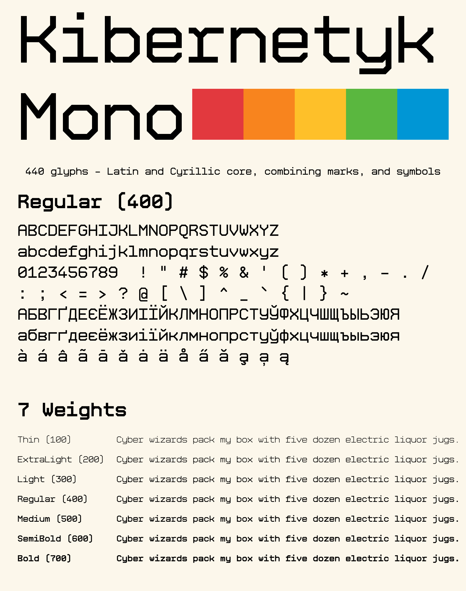

# Kibernetyk Mono

[Download Kibernetyk Mono](https://github.com/PavloKilko/KibernetykMono/releases/latest) • [Typeface microsite](https://pavlokilko.github.io/KibernetykMono) ↗️

Kibernetyk Mono is a geometric monospace typeface inspired by the pioneering
spirit of the Ukrainian Cybernetics School. Its rigid, pared-back letterforms
recall early mainframe interfaces and the ink-stamped texture of fax
transmissions. It is drawn from points and lines for clean code, dense data,
and the infrastructure that holds them together. The family includes seven
weights with Latin and Cyrillic support.




## Build

### Option №1: use Shell build script.

Build all seven release TTFs from the editable Glyphs source:

```sh
./sources/build.sh
```

The fonts are written to `fonts/ttf`.

### Option №2: use Python build script.

Create and activate the Conda environment:

```sh
conda env create -f environment.yml
conda activate font-builder
```

For an individual procedural development build, run:

```sh
python -m kibernetyk_mono_font_builder build
```

The font is written to `build/regular/KibernetykMono-Regular.ttf`. To build a
different weight, pass `--weight` with one of `thin`, `extralight`, `light`,
`regular`, `medium`, `semibold`, or `bold`.

## License

Kibernetyk Mono is licensed under the SIL Open Font License, Version 1.1. See
[`OFL.txt`](./OFL.txt).
